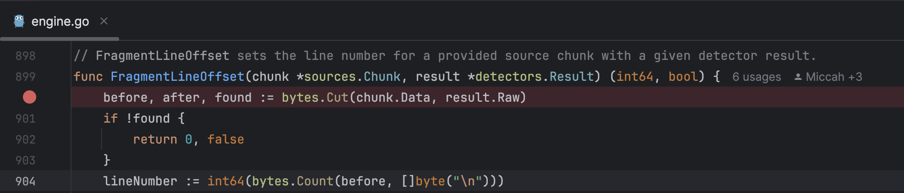
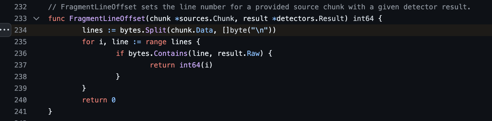
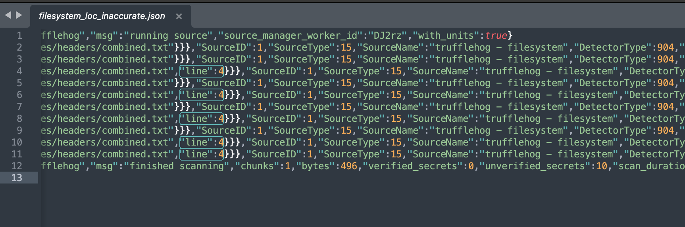
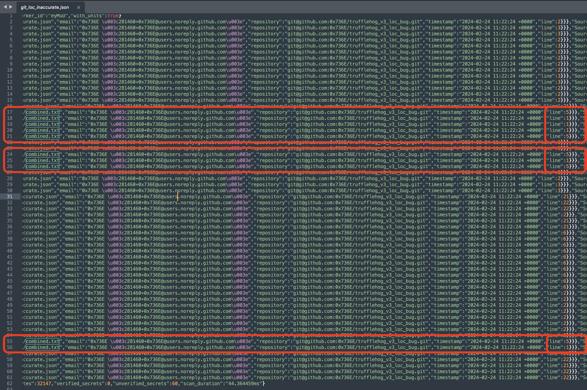

# Introduction
This repository documents **_line of code calculation bugs_** which is present in TruffleHog secrets scanner, as 
reported in the following issues in the TruffleHog GitHub issue tracker:
* [#2502 - Line of code calculation is wrong for sequential identical secrets](https://github.com/trufflesecurity/trufflehog/issues/2502)
* [#2504 - Presence of 'line of code' values are inconsistently presented in results, depending upon the data source configured](https://github.com/trufflesecurity/trufflehog/issues/2504)

### Bug #2502 - Line of code calculation is wrong for sequential identical secrets

#### Description
When the same secret occurs _multiple times_ in a _contiguous sequence_, TruffleHog incorrectly calculates the line of code 
value for each subsequent instance of a secret as having the same value as the first occurrence. This results in the 
first instance of a secret having the correct value for the line number, but all following instances having the same 
value, which is incorrect.

#### Affected versions
Analysis indicates that this bug was introduced in [PR #520](https://github.com/trufflesecurity/trufflehog/pull/520) 
 which was merged on **May 04 2022**, and first appeared in [TruffleHog v3.4.3](https://github.com/trufflesecurity/trufflehog/releases/tag/v3.4.3)
 on **May 05 2022**.

#### Root Cause
Data chunking is used internally in TruffleHog to optimise for performance, by setting a maximum amount of data that a 
secret detector will process at a time. However, the implementation of this methodology loses some context including the
occurrence number (index) of the found secret. 

This loss of context information leads to a scenario such that if the exact same _raw secret value_ is present 
sequentially in a data chunk, then when the line of code is calculated, the first instance of the _raw secret value_ 
is used as a reference point for calculation instead of the actual location where the secret may have actually been 
found.

##### Source 
In the file /pkg/engine.go, in the FragmentLineOffset method, on
[line number 900](https://github.com/trufflesecurity/trufflehog/blob/8a825fde5209cf97443d269ee018caad6b86d783/pkg/engine/engine.go#L900)
, the data chunk is broken up into three pieces (before, after, and found) using the
[bytes.Cut](https://pkg.go.dev/bytes#Cut) function:

The behaviour of this function is such that it will split the data upon encountering the *first* occurrence of the 
supplied prefix, in this case that is the _raw secret value_ (result.Raw). The consequence of this is that each time the
engine calculates the line of code value, it is calculating it from the same line each time regardless of which instance
 of the occurrence that this calculation is intended for.

Previous to TruffleHog version 3.28.0 similar behaviour was first introduced in [v3.4.3 on line 234](https://github.com/trufflesecurity/trufflehog/blob/212aa9ba1e4698807023a1c11be6f9f77bef2a2c/pkg/engine/engine.go#L234)
using the [bytes.Split](https://pkg.go.dev/bytes#Split) function:

### Bug #2504 - Presence of 'line of code' values are inconsistently presented in results, depending upon the data source configured

#### Description

Line of code values reported by TruffleHog are inconsistently present depending upon the data source selected. It has 
been observed that the filesystem data source does not always present the line of code values in results as presented by
 TruffleHog.

In the below screenshot, which shows [/results/filesystem_loc_inaccurate.json](./results/filesystem_loc_inaccurate.json)
, we can see that of the 10 results presented (lines 2-11), only 5 of the results contain a line number, despite the 
findings being produced in the same file, using the same regular expression pattern, with the similar 'raw secret' results:

Comparing the above screenshot, to the below, which is taken from [/results/git_loc_inaccurate.json](./results/git_loc_inaccurate.json)
we can see that each finding produced with the 'git' data source contains line of code values. These values are
 incorrect due to bug [#2502](https://github.com/trufflesecurity/trufflehog/issues/2502) described above, however they 
are present in that data source but not the 'filesystem' data source, which is issue at hand with bug
[#2504](https://github.com/trufflesecurity/trufflehog/issues/2504).

#### Affected versions
Observed in TruffleHog v3.68.0, no other versions have been tested at this point.

#### Root Cause
Unknown.

